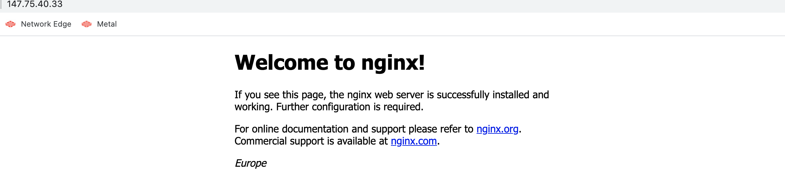

# Global IPs on Equinix Metal
Project to show how to use Global IPs on Equinix Metal using two different regions

## Using the provider

The Equinix Metal provider will be installed on `terraform init` of a template using any of the `metal_*` resources.

See <https://registry.terraform.io/providers/equinix/metal/latest/docs> for documentation on the resources included in this provider.

## Pre-Requisites

Before you can start, you need to have the following:

* Configure Terraform properly to provision infrastructure in your Equinix Metal account
* An Equinix Metal org-id and [API key](https://metal.equinix.com/developers/api/)

## What's Being Deployed?

If you decide to use the Terraform configuration files from this repository, you'll create the following:

* 1 Global IP
* 2 Metal servers that will host a NGINX home landing page that will be modified just adding Europe (if the server name finish in "eu") and America (if the server name finish in "us")
* The attachment of the Global IP created to the Metal servers acting as *servers*
* 2 Metal servers that will act as *clients* to test the Global IP from Europe and/or America. Of course you can ignore the ones that are in your same region, but it will be created anyway.

## Deployment architecture

TBD

## How to deploy?

It should be necessary to just include the data missing in the terraform.tfvars file, these are:

* customer_name   -> Name of the customer/user for the prefixes of the devices
* project_id      -> your Project ID on Equinix Metal  
* organization_id -> your Organization Account ID from Equinix Metal
* metal_token     -> your Metal API Key

After that, you should be able to run the deployment using terraform:

```sh
terraform init
terraform apply
```

## How to test it?

From the output you can extract several IPs:

* 2 from Metal *servers*
* 2 from Metal *clients*
* 1 from Metal Global IP

From your region, you can use directly in the browser the Global IP and check if is responding the one from your location. In my case I am in Europe so I can see this webpage:



To test the same request from America, expecting the response from America server, we should connect to America client (*us-test-ip* from the Terraform output). So, you can connect using ssh and run:

```sh
curl http://{GLOBAL_IP}
```

Being {GLOBAL_IP} the one you used before from your local computer.

The response should be something like this:


## How to destroy the environment?

After the demonstratio you can destroy the environment running:

```sh
terraform destroy
```
